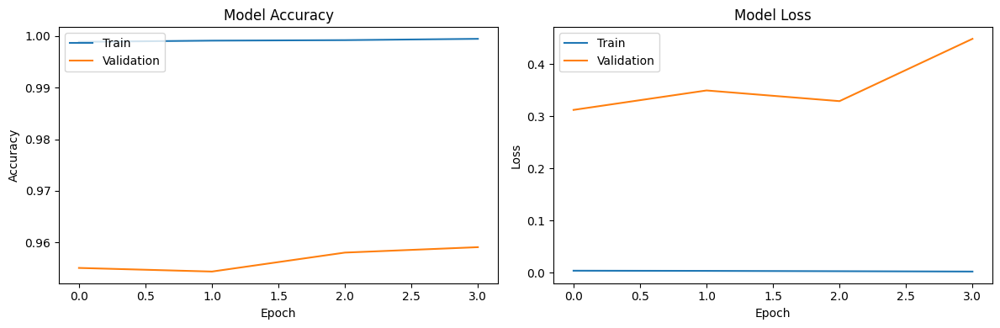

# Fake News Detector - Deep Learning Machine University Project

We have decided to make an improvement on this research project: [Fake News Detector RNN](https://www.kaggle.com/code/muhammadwaseem123/fake-news-detector-rnn).
and use this as the baseline model

## Base Model
we use dataset from [Kaggle](https://www.kaggle.com/datasets/saurabhshahane/fake-news-classification), split it train:test 80:20
, use model architect of this notebook [Fake News Detector RNN](https://www.kaggle.com/code/muhammadwaseem123/fake-news-detector-rnn). Create a ModelCheckpoint callback that saves the model's weights every 5 epochs ,Create an EarlyStopping callback that stops training when the validation loss has not improved for 3 consecutive epochs here is result:

**Model Accuracy:**
The training accuracy is very high (almost 100%) after just a few epochs, while the validation accuracy is much lower and remains almost flat, around 96%.

The gap between training accuracy and validation accuracy is significant, which could be an indicator of overfitting.

**Model Loss:**
The training loss is very low, near zero, while the validation loss starts at a moderate value and keeps increasing.

The growing gap between training and validation loss is another indicator of overfitting. This shows that while the model is learning the training data perfectly, it is struggling to generalize to the validation data.

## Model 1
We trained our model with the RNN model optimization to fix the overfitting model, we use kaggle dataset only but 
here is the result:

Model Accuracy: Training accuracy quickly reaches almost 100%, while validation accuracy starts to plateau after a few epochs and fluctuates slightly.
Model Loss: Training loss decreases steadily, but validation loss increases after the first few epochs, showing an increasing divergence between training and validation loss.

The dataset from [Kaggle](https://www.kaggle.com/datasets/saurabhshahane/fake-news-classification) This data will be used as the training model.

The dataset from [HuggingFace](https://drive.google.com/file/d/1fOVo2Wh4scjYNs7PjEA-wHtc3wlWGQfe/view). This data will be used as the testing model.

**DATASETS**

Training dataset(from kaggle) - https://drive.google.com/file/d/1gD_Q-ksCZlJfgKA22qxpt3TujxLBw4JT/view?usp=sharing

Testing dataset(from hugging_face) - https://drive.google.com/file/d/1fOVo2Wh4scjYNs7PjEA-wHtc3wlWGQfe/view?usp=share_link

**(Figure 1. Cleaned dataset)**

**STEPS**

1. Download the dataset from [Kaggle](https://www.kaggle.com/code/muhammadwaseem123/fake-news-detector-rnn) This data will be used as the training model.

2. Download the data from [HuggingFace](https://drive.google.com/file/d/1fOVo2Wh4scjYNs7PjEA-wHtc3wlWGQfe/view). This data will be used as the testing model.

3. Clean training & testing dataset(including applying the back translation)

**(Figure 2. Back translated dataset)**

5. Use LSTM baseline model as stated in the Overview section.

6. TBC...

## **RESEARCHES & REFERENCE**

Back Translation - https://www.mdpi.com/2076-3417/13/24/13207

Back Translation Implementation - https://www.fiive.se/en/blog/backtranslation-for-ner

Googletrans - https://pypi.org/project/googletrans/#description

Data Preprocessing - https://www.javatpoint.com/data-preprocessing-machine-learning

Basic NLP Augmentation - https://maelfabien.github.io/machinelearning/NLP_8/#
